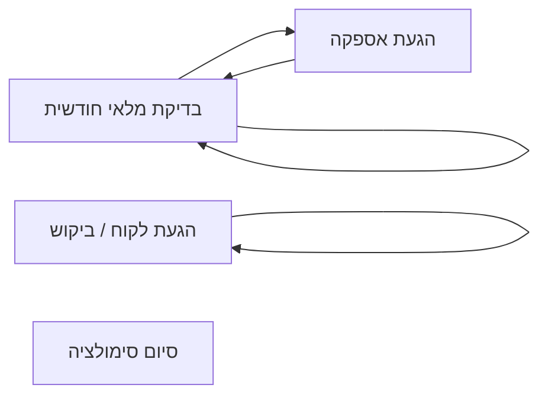
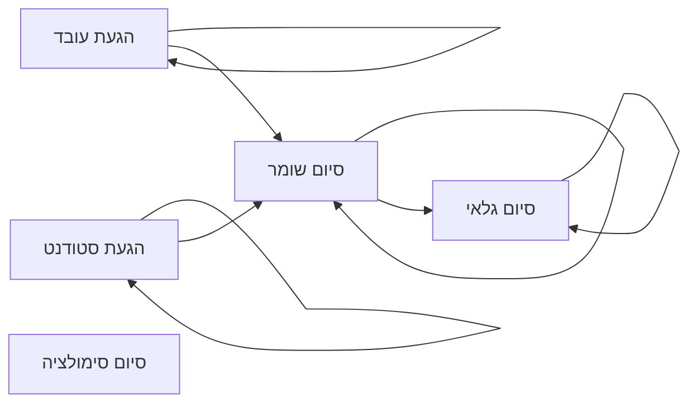
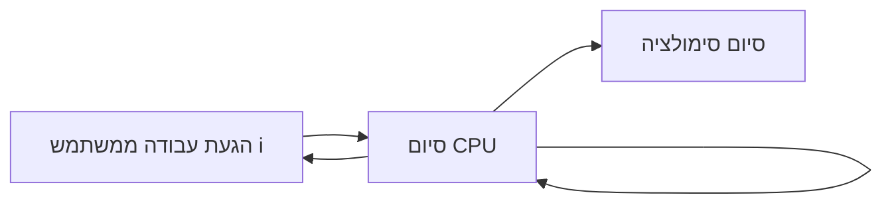
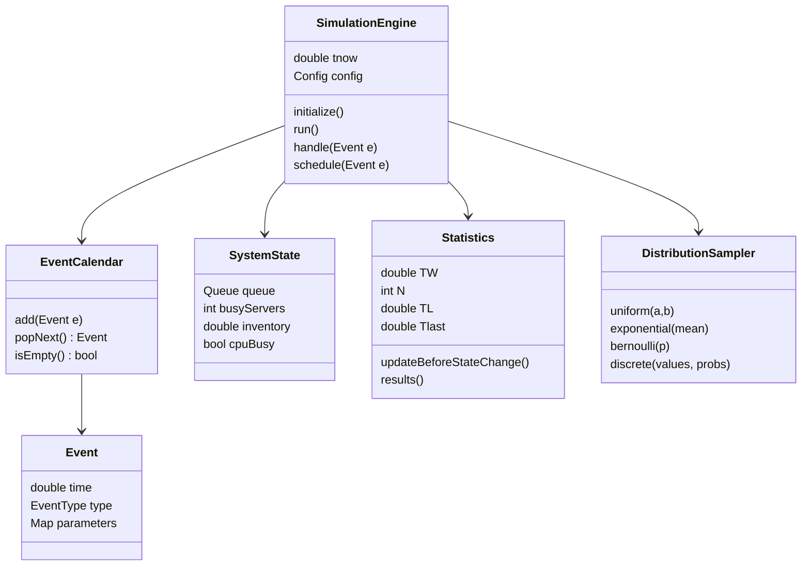
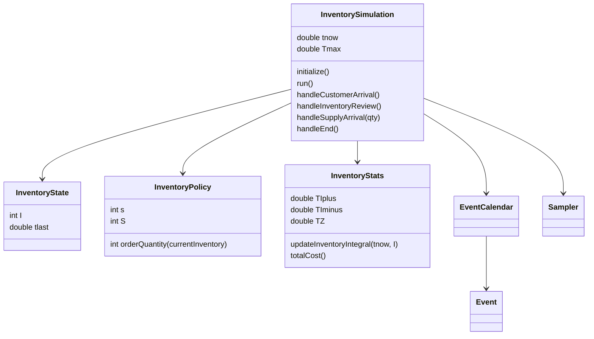
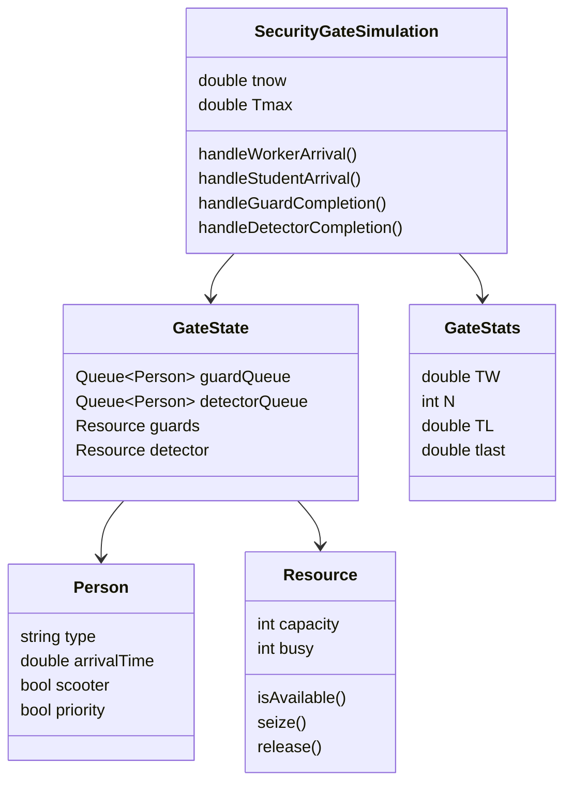
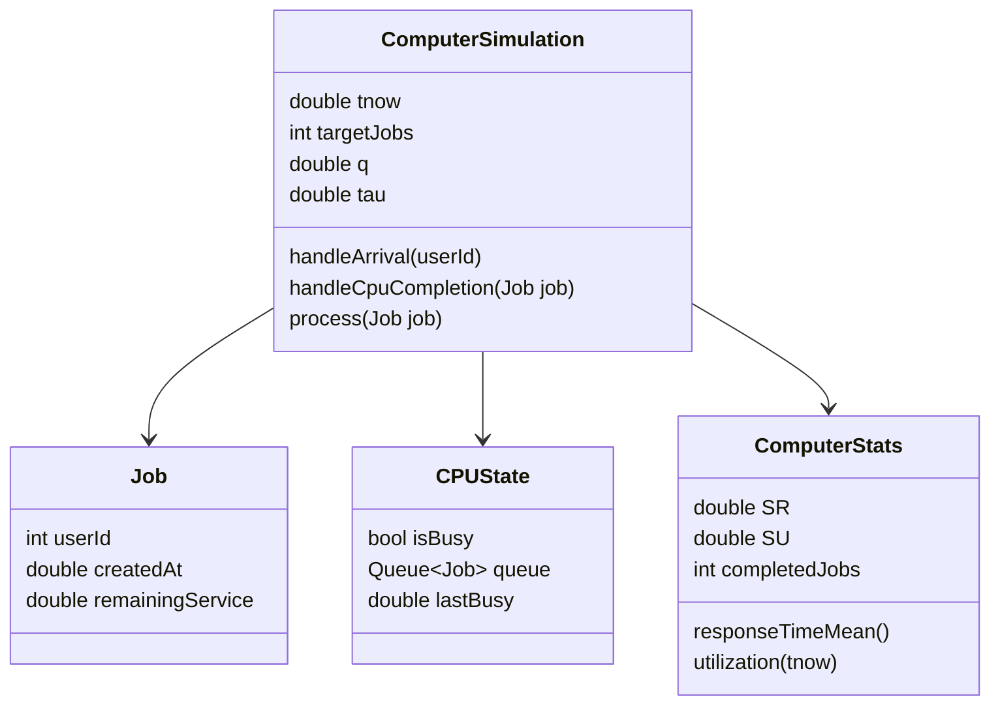

# קובץ קונטקסט מלא לקורס סימולציה

> מטרת המסמך: לשמש קובץ קונטקסט עצמאי לחומרי הקורס. אדם חיצוני, מודל שיחה, סטודנט חדש או מתרגל שיקראו את המסמך אמורים להבין מה הקורס מנסה ללמד, באילו כלים משתמשים, למה הכלים חשובים, איך בונים סימולציה, איך דוגמים משתנים מקריים, איך מנתחים פלט, איך משווים חלופות ואיך ניגשים לתרגילים ולפרויקטים בקורס.

---

## תוכן עניינים

1. [מהו הקורס ומה הרעיון המרכזי שלו](#מהו-הקורס-ומה-הרעיון-המרכזי-שלו)
2. [תמונה גדולה: מחקר סימולציה מקצה לקצה](#תמונה-גדולה-מחקר-סימולציה-מקצה-לקצה)
3. [בסיס הסתברותי: משתנים מקריים, פונקציות והתפלגויות](#בסיס-הסתברותי-משתנים-מקריים-פונקציות-והתפלגויות)
4. [מספרים פסאודו-אקראיים וזרמי מספרים](#מספרים-פסאודו-אקראיים-וזרמי-מספרים)
5. [אלגוריתמי דגימה בקורס](#אלגוריתמי-דגימה-בקורס)
6. [בחירת התפלגות למודל מתוך נתונים](#בחירת-התפלגות-למודל-מתוך-נתונים)
7. [בניית מודל סימולציה: ישויות, משאבים, מצב ואירועים](#בניית-מודל-סימולציה-ישויות-משאבים-מצב-ואירועים)
8. [שיטת חמשת השלבים לתכנות אירועים](#שיטת-חמשת-השלבים-לתכנות-אירועים)
9. [תרשים אירועים: מהו ואיך בונים אותו](#תרשים-אירועים-מהו-ואיך-בונים-אותו)
10. [תרשים מחלקות: איך לתרגם סימולציה למבנה תוכנה](#תרשים-מחלקות-איך-לתרגם-סימולציה-למבנה-תוכנה)
11. [דוגמה 1: מודל מלאי של חנות יין](#דוגמה-1-מודל-מלאי-של-חנות-יין)
12. [דוגמה 2: בידוק בכניסה לאוניברסיטה](#דוגמה-2-בידוק-בכניסה-לאוניברסיטה)
13. [דוגמה 3: מערכת מחשב עם Round Robin](#דוגמה-3-מערכת-מחשב-עם-round-robin)
14. [וריפיקציה ולידציה](#וריפיקציה-ולידציה)
15. [מערכת מסתיימת ומערכת לא מסתיימת](#מערכת-מסתיימת-ומערכת-לא-מסתיימת)
16. [ניתוח פלט של מערכת בודדת](#ניתוח-פלט-של-מערכת-בודדת)
17. [מדדים: ממוצע על ישויות, ממוצע בזמן ופרופורציות](#מדדים-ממוצע-על-ישויות-ממוצע-בזמן-ופרופורציות)
18. [רווחי סמך ומספר הרצות נדרש](#רווחי-סמך-ומספר-הרצות-נדרש)
19. [ניתוח כמה מדדים יחד ואי שוויון בונפרוני](#ניתוח-כמה-מדדים-יחד-ואי-שוויון-בונפרוני)
20. [מערכות לא מסתיימות: זמן חימום ומצב יציב](#מערכות-לא-מסתיימות-זמן-חימום-ומצב-יציב)
21. [שיטות מונטה קרלו ואינטגרציה](#שיטות-מונטה-קרלו-ואינטגרציה)
22. [השוואה בין שתי חלופות](#השוואה-בין-שתי-חלופות)
23. [CRN והפחתת שונות](#crn-והפחתת-שונות)
24. [השוואה בין יותר משתי חלופות](#השוואה-בין-יותר-משתי-חלופות)
25. [Ranking and Selection](#ranking-and-selection)
26. [צ'ק ליסטים לפתרון תרגילים](#צק-ליסטים-לפתרון-תרגילים)
27. [מילון מושגים קצר](#מילון-מושגים-קצר)
28. [טעויות נפוצות בקורס](#טעויות-נפוצות-בקורס)
29. [איך להשתמש במסמך הזה כקונטקסט למודל שיחה](#איך-להשתמש-במסמך-הזה-כקונטקסט-למודל-שיחה)

---

## מהו הקורס ומה הרעיון המרכזי שלו

הקורס עוסק בסימולציה של מערכות אקראיות, בעיקר מערכות שבהן קורים אירועים לאורך זמן: לקוחות מגיעים, תורים נוצרים, שרתים מתפנים, הזמנות מלאי מגיעות, עבודות נשלחות למעבד, מכונות מתקלקלות או יחידות עוברות בין מצבים. במקום לפתור את המערכת בצורה אנליטית מלאה, הקורס מלמד איך לבנות מודל ממוחשב שמחקה את ההתנהגות של המערכת, להריץ אותו פעמים רבות, לאסוף פלטים, לנתח אותם סטטיסטית ולקבל החלטות.

הנקודה החשובה ביותר בקורס היא זו: **פלט של סימולציה הוא משתנה מקרי**. גם אם המודל והקוד קבועים, בכל הרצה מתקבלות תוצאות שונות, כי זמני הגעה, זמני שירות, ביקושים וגדלים נוספים נדגמים באופן אקראי. לכן לא מספיק להריץ פעם אחת ולהחליט. צריך לתכנן ניסוי, להריץ חזרות בלתי תלויות, לחשב ממוצעים ורווחי סמך, לבדוק דיוק, להשוות חלופות ולהבין את אי הוודאות.

הקורס מערב ארבע שכבות ידע:

1. **הסתברות וסטטיסטיקה**: משתנים מקריים, התפלגויות, תוחלת, שונות, רווחי סמך, מבחני התאמה, מבחני השערות.
2. **דגימה ממוחשבת**: איך מייצרים מספרים אחידים, איך הופכים אותם למשתנים מהתפלגות רצויה, איך דוגמים ממודלים מסובכים.
3. **תכנות אירועים בדידים**: בניית יומן אירועים, מצב מערכת, תורים, משאבים, ישויות, פסאודוקוד ותרשימי זרימה.
4. **ניתוח החלטות**: ניתוח פלט, השוואת חלופות, הפחתת שונות, בחירת המערכת הטובה ביותר.

---

## תמונה גדולה: מחקר סימולציה מקצה לקצה

מחקר סימולציה טיפוסי אינו מתחיל בקוד. הוא מתחיל בשאלה עסקית או הנדסית. לדוגמה:

- האם כדאי להוסיף כספר בבנק?
- האם מדיניות מלאי `(s,S)` מסוימת זולה יותר ממדיניות אחרת?
- האם עדיף שרת מהיר אחד או שני שרתים איטיים?
- האם שינוי סדרי התור מקצר זמני המתנה?
- מה תהיה נצילות CPU תחת מדיניות Round Robin?

הקורס מציג את מחקר הסימולציה כתהליך מעגלי:

1. **מטרה**: מה רוצים לדעת ולמה?
2. **נתונים וידע**: מה ידוע על המערכת, אילו התפלגויות מתאימות, אילו מדדים חשובים?
3. **תכנון ויצירת המודל**: אילו ישויות ומשאבים קיימים, מהם האירועים, אילו משתני מצב דרושים?
4. **וריפיקציה**: האם התכנות נכון? האם הקוד עושה את מה שהתכוונו?
5. **ולידציה**: האם המודל מייצג את המציאות בצורה סבירה?
6. **תכנות והרצות**: מריצים את הסימולציה עם אלגוריתמי דגימה מתאימים.
7. **ניתוח הרצות**: מחשבים מדדים, רווחי סמך, דיוק ומובהקות.
8. **יישום או החלטה**: בוחרים חלופה, מעריכים שיפור, או חוזרים לשפר את המודל.

המסר: סימולציה היא לא רק כתיבת קוד. היא ניסוי סטטיסטי ממוחשב. הקוד הוא המעבדה, אבל התכנון והניתוח הם המיקרוסקופ.

---

## בסיס הסתברותי: משתנים מקריים, פונקציות והתפלגויות

### מרחב מדגם ומשתנה מקרי

ניסוי אקראי הוא פעולה שהתוצאה שלה אינה ידועה מראש. לדוגמה: זמן הגעה של לקוח, מספר בקבוקים שלקוח מזמין, משך שירות, משך משלוח.

- **מרחב מדגם** `S`: כל התוצאות האפשריות.
- **משתנה מקרי** `X`: פונקציה שממפה תוצאה מהמרחב למספר.

דוגמה: אם מטילים שתי קוביות, מרחב המדגם הוא זוגות אפשריים. אפשר להגדיר `X` כסכום שתי הקוביות. במקרה כזה `X` הוא משתנה מקרי שמקבל ערכים כמו 2, 3, ..., 12.

### פונקציית הסתברות למשתנה בדיד

למשתנה מקרי בדיד מגדירים:

\[
p_X(x)=P(X=x)
\]

תכונות בסיסיות:

1. `p(x) >= 0` לכל `x`.
2. סכום כל ההסתברויות שווה 1:

\[
\sum_x p(x)=1
\]

דוגמה בדידה מתוך מודל מלאי:

| ביקוש D | הסתברות |
|---:|---:|
| 1 | 1/6 |
| 2 | 1/3 |
| 3 | 1/3 |
| 4 | 1/6 |

זו התפלגות קטגוריאלית/בדידה. היא שימושית כשיש מספר קטן של תוצאות אפשריות, למשל גודל הזמנה של לקוח.

### פונקציית צפיפות למשתנה רציף

למשתנה רציף אין הסתברות נקודתית חיובית עבור ערך יחיד, כלומר לרוב:

\[
P(X=x)=0
\]

במקום זאת משתמשים בצפיפות `f(x)` ומחשבים הסתברויות על קטעים:

\[
P(a \le X \le b)=\int_a^b f(x)dx
\]

תכונות צפיפות:

1. `f(x) >= 0`.
2. השטח הכולל מתחת לצפיפות הוא 1:

\[
\int_{-\infty}^{\infty} f(x)dx=1
\]

### פונקציית התפלגות מצטברת, CDF

פונקציית ההתפלגות המצטברת מוגדרת כך:

\[
F(x)=P(X \le x)
\]

תכונות חשובות:

1. `0 <= F(x) <= 1`.
2. `F(x)` לא יורדת.
3. כאשר `x -> -∞`, אז `F(x) -> 0`.
4. כאשר `x -> ∞`, אז `F(x) -> 1`.
5. עבור משתנה רציף עם צפיפות, מתקיים:

\[
F(x)=\int_{-\infty}^{x} f(t)dt
\]

ובמקרים רגילים:

\[
f(x)=F'(x)
\]

### תוחלת ושונות

התוחלת היא הממוצע התיאורטי של המשתנה:

בדיד:

\[
E[X]=\sum_x x p(x)
\]

רציף:

\[
E[X]=\int_{-\infty}^{\infty} x f(x)dx
\]

השונות מודדת פיזור סביב התוחלת:

\[
Var(X)=E[(X-E[X])^2]
\]

או:

\[
Var(X)=E[X^2]-E[X]^2
\]

בסימולציה התוחלת היא לעיתים מה שמנסים לאמוד. לדוגמה, תוחלת זמן ההמתנה בתור, תוחלת עלות חודשית, תוחלת נצילות, תוחלת מספר לקוחות שהספיקו לקבל שירות.

---

## התפלגויות מרכזיות בקורס

### התפלגות אחידה רציפה `U(a,b)`

משתנה אחיד רציף על הקטע `[a,b]` מקבל ערכים באופן שווה על פני הקטע.

צפיפות:

\[
f(x)=\frac{1}{b-a}, \quad a \le x \le b
\]

תוחלת:

\[
E[X]=\frac{a+b}{2}
\]

שונות:

\[
Var(X)=\frac{(b-a)^2}{12}
\]

שימושים בקורס:

- זמן משלוח בין חצי חודש לחודש: `U(0.5,1)`.
- זמן בדיקת עובד או סטודנט אצל שומר: `U(0.5,1)`.
- זמן בדיקת תיק: `U(1,2)`.
- בסיס לדגימה מכל התפלגות אחרת, כי כמעט כל אלגוריתם דגימה מתחיל מ-`U(0,1)`.

### התפלגות אחידה בדידה

כאשר בוחרים אחת מתוך כמה תוצאות במספר שווה של הסתברויות. לדוגמה, בחירה אקראית של מספר שלם מתוך `{1,2,3,4}`.

אם יש `n` ערכים אפשריים:

\[
P(X=x_i)=\frac{1}{n}
\]

### Bernoulli

משתנה Bernoulli מקבל 1 בהסתברות `p` ו-0 בהסתברות `1-p`.

\[
X \sim Bernoulli(p)
\]

שימושים בקורס:

- האם סטודנט מגיע עם סקוטר? לדוגמה, 30% כן.
- האם עובד עוקף לראש התור? לדוגמה, 80% כן.
- כל החלטה בינארית בסימולציה.

אלגוריתם דגימה פשוט:

1. דגום `U ~ U(0,1)`.
2. אם `U < p`, החזר 1.
3. אחרת החזר 0.

### התפלגות קטגוריאלית או בדידה כללית

כאשר יש כמה תוצאות אפשריות עם הסתברויות שונות. לדוגמה:

\[
P(D=1)=\frac16, \quad P(D=2)=\frac13, \quad P(D=3)=\frac13, \quad P(D=4)=\frac16
\]

שימוש: גודל הזמנת לקוח במודל מלאי.

### התפלגות מעריכית `Exponential`

ההתפלגות המעריכית משמשת בעיקר לזמני הגעה בין מופעים ולזמני שירות כאשר מניחים תהליך חסר זיכרון.

אם משתמשים בפרמטר קצב `λ`:

\[
f(x)=\lambda e^{-\lambda x}, \quad x \ge 0
\]

\[
E[X]=\frac{1}{\lambda}
\]

אם משתמשים בפרמטר תוחלת `θ`, לעיתים כותבים:

\[
X \sim Exp(\theta)
\]

כאשר `θ` הוא הממוצע. צריך לשים לב בכל תרגיל האם הפרמטר הוא קצב או תוחלת. בקורס מופיעים ניסוחים כמו "מגיעים בממוצע כל 4 דקות בהתפלגות מעריכית", כלומר התוחלת היא 4 דקות, והקצב הוא `1/4` לדקה.

שימושים בקורס:

- הגעת לקוחות לבנק.
- הגעת עובדים וסטודנטים לשער.
- זמן חשיבה של משתמש במערכת מחשב.
- זמן עיבוד עבודה ב-CPU.
- הגעת לקוחות לחנות מלאי.

### התפלגות נורמלית

הקורס משתמש בנורמליות בעיקר בניתוח פלט, לא בהכרח כדגימה ישירה של קלטים. בגלל משפט הגבול המרכזי, ממוצעים של חזרות רבות נוטים להתנהג נורמלית בקירוב.

דגימה אפשרית מנורמלית נעשית באמצעות שיטות כמו סכום אחידים או Box-Muller, שמופיעה ברקע של אלגוריתמי דגימה.

### התפלגות אמפירית

כאשר אין התאמה ברורה להתפלגות תיאורטית, ניתן להשתמש בנתונים עצמם כהתפלגות:

- עבור נתונים בדידים: לבחור ערך מתוך הדאטה לפי שכיחויות.
- עבור נתונים רציפים: לבנות היסטוגרמה או התפלגות קטעית ולדגום מתוכה.

זה חשוב כי לא כל תופעה אמיתית מתאימה יפה לאחידה, מעריכית או נורמלית.

---

## מספרים פסאודו-אקראיים וזרמי מספרים

### למה צריך מספרים פסאודו-אקראיים

המחשב הוא דטרמיניסטי. לכן הוא אינו מייצר אקראיות "אמיתית" באופן רגיל. במקום זאת הוא מייצר סדרה שנראית אקראית באמצעות נוסחה דטרמיניסטית. הסדרה נקראת **פסאודו-אקראית**.

היעד הבסיסי הוא לייצר מספרים שנראים כמו דגימות בלתי תלויות מתוך:

\[
U(0,1)
\]

לאחר מכן משתמשים בהם כדי לדגום מכל התפלגות אחרת.

### Seed

`Seed` הוא הערך ההתחלתי של מחולל המספרים. אם משתמשים באותו Seed, מקבלים בדיוק אותה סדרה. זה חשוב מאוד:

- לשחזור תוצאות.
- לבדיקת קוד.
- להשוואת חלופות באמצעות CRN.
- להפרדת זרמי אקראיות שונים.

### Linear Congruential Generator, LCG

אחד המחוללים הבסיסיים בקורס הוא LCG:

\[
Z_i=(aZ_{i-1}+c) \mod m
\]

ואז:

\[
U_i=\frac{Z_i}{m}
\]

כאשר:

- `Z0` הוא ה-seed.
- `a` הוא multiplier.
- `c` הוא increment.
- `m` הוא modulus.

המחולל יוצר סדרת מספרים שלמים בין `0` ל-`m-1`, ואז ממיר אותם למספרים בין 0 ל-1.

#### דוגמה רעיונית

אם:

\[
Z_i=(5Z_{i-1}+3) \mod 16
\]

ו-`Z0=7`, נקבל סדרה מחזורית של ערכים. כל ערך מחולק ב-16 כדי לקבל `Ui`.

#### מחזוריות

כל מחולל כזה הוא מחזורי. בשלב מסוים הוא יחזור לערך שכבר הופיע, ומכאן כל הסדרה תחזור על עצמה. לכן חשוב לבחור פרמטרים שנותנים מחזור ארוך ככל האפשר.

### תנאים למחזור מלא ב-LCG

ב-LCG עם `m`, `a`, `c`, כדי לקבל מחזור מלא יש תנאים ידועים. בניסוח כללי:

1. `c` ו-`m` צריכים להיות זרים.
2. `a-1` צריך להתחלק בכל גורם ראשוני של `m`.
3. אם `m` מתחלק ב-4, אז גם `a-1` צריך להתחלק ב-4.

החשיבות בקורס אינה בהוכחה אלא בהבנה שמחולל לא טוב יכול ליצור דפוסים, מחזור קצר או תלות בין דגימות.

### זרמים נפרדים של מספרים אקראיים

בסימולציה יש כמה מקורות אקראיות:

- זמני הגעה.
- זמני שירות.
- גודל ביקוש.
- זמן משלוח.
- החלטות Bernoulli.

מומלץ להקצות **זרם מספרים נפרד לכל מקור אקראיות**. לדוגמה:

| זרם | שימוש |
|---|---|
| Stream 1 | זמני הגעה |
| Stream 2 | זמני שירות |
| Stream 3 | גודל ביקוש |
| Stream 4 | החלטות Bernoulli |
| Stream 5 | זמן משלוח |

זה עוזר לשחזור, לתחזוקה ול-CRN.

### LFSR ו-GFSR

בחומר מופיעים גם רעיונות של מחוללים בינאריים כמו LFSR ו-GFSR:

- **LFSR, Linear Feedback Shift Register**: סדרת ביטים שמתקדמת בעזרת פעולת XOR בין ביטים במיקומים מסוימים.
- **GFSR, Generalized Feedback Shift Register**: הכללה שבה יוצרים מילים בינאריות ארוכות יותר בעזרת XOR בין ערכים קודמים.

העיקרון: במקום לחשב מודולו כמו ב-LCG, עובדים בבסיס בינארי עם הזזות ו-XOR. המחוללים האלה חשובים כדי להבין שמאחורי `random()` יש מנגנון מתמטי, ולא קסם מהמדבר.

---

## אלגוריתמי דגימה בקורס

כמעט כל אלגוריתם דגימה מתחיל מ:

\[
U \sim U(0,1)
\]

ואז הופך את `U` למשתנה מקרי מההתפלגות הרצויה.

---

### 1. דגימה מ-Bernoulli

עבור `X ~ Bernoulli(p)`:

```text
דגום U ~ U(0,1)
אם U < p:
    החזר 1
אחרת:
    החזר 0
```

דוגמה: 80% מהעובדים עוקפים לתחילת התור:

```text
U ~ U(0,1)
if U < 0.8:
    העובד נכנס לתחילת התור
else:
    העובד נכנס לסוף התור
```

---

### 2. דגימה מהתפלגות בדידה כללית

אם `X` מקבל ערכים `x1, x2, ..., xn` עם הסתברויות `p1, p2, ..., pn`, מחלקים את הקטע `[0,1]` לפי ההסתברויות.

לדוגמה:

| ערך | הסתברות | תחום U |
|---:|---:|---|
| 1 | 1/6 | `[0,1/6)` |
| 2 | 1/3 | `[1/6,1/2)` |
| 3 | 1/3 | `[1/2,5/6)` |
| 4 | 1/6 | `[5/6,1]` |

פסאודוקוד:

```text
דגום U ~ U(0,1)
אם U < p1: החזר x1
אחרת אם U < p1+p2: החזר x2
אחרת אם U < p1+p2+p3: החזר x3
...
אחרת: החזר xn
```

---

### 3. שיטת ההתמרה ההופכית, Inverse Transform

זו אחת השיטות החשובות ביותר בקורס.

אם `F` היא פונקציית ההתפלגות המצטברת של `X`, אז:

\[
X=F^{-1}(U), \quad U \sim U(0,1)
\]

מייצר משתנה מקרי עם ההתפלגות `F`.

האלגוריתם:

```text
1. דגום U ~ U(0,1)
2. חשב X = F^{-1}(U)
3. החזר X
```

#### למה זה עובד

אם `X=F^{-1}(U)`, אז:

\[
P(X \le x)=P(F^{-1}(U) \le x)=P(U \le F(x))=F(x)
\]

כלומר ההתפלגות של `X` היא בדיוק ההתפלגות הרצויה.

---

### 4. דגימה מהתפלגות אחידה `U(a,b)`

אם `U ~ U(0,1)`, אז:

\[
X=a+(b-a)U
\]

דוגמאות:

- `U(0.5,1)`:

\[
X=0.5+0.5U
\]

- `U(1,2)`:

\[
X=1+U
\]

---

### 5. דגימה מהתפלגות מעריכית

אם `X ~ Exp(λ)` עם קצב `λ`, אז:

\[
F(x)=1-e^{-\lambda x}
\]

נפתור:

\[
U=1-e^{-\lambda x}
\]

נקבל:

\[
X=-\frac{1}{\lambda}\ln(1-U)
\]

מכיוון ש-`1-U` מתפלג גם הוא אחיד, אפשר לכתוב:

\[
X=-\frac{1}{\lambda}\ln(U)
\]

אם נתון ממוצע `θ`, אז `λ=1/θ`, ולכן:

\[
X=-\theta \ln(U)
\]

דוגמה: זמן בין הגעות סטודנטים עם ממוצע 1 דקה:

\[
X=-1\cdot \ln(U)
\]

דוגמה: זמן בין הגעות עובדים עם ממוצע 4 דקות:

\[
X=-4\ln(U)
\]

---

### 6. דגימה מהתפלגות עם CDF קטעית

לפעמים `F(x)` מוגדרת בקטעים. במקרה כזה:

1. דוגמים `U`.
2. בודקים באיזה תחום של `F` נמצא `U`.
3. פותרים את הנוסחה המתאימה לאותו קטע.

דוגמה עקרונית:

\[
F(x)=
\begin{cases}
0, & x<0 \\
\frac{x^2}{4}, & 0 \le x \le 2 \\
1, & x>2
\end{cases}
\]

אם `0 < U < 1`, פותרים:

\[
U=\frac{x^2}{4}
\]

ולכן:

\[
X=2\sqrt{U}
\]

---

### 7. שיטת הקומפוזיציה, Composition

משתמשים בה כאשר ההתפלגות היא ערבוב של כמה התפלגויות:

\[
f(x)=\sum_{j=1}^{k} p_j f_j(x)
\]

האלגוריתם:

```text
1. בחר אינדקס j לפי ההסתברויות p1,...,pk
2. דגום X מתוך fj
3. החזר X
```

מתי זה שימושי?

- כאשר אוכלוסייה מורכבת מכמה סוגי לקוחות.
- כאשר זמן שירות תלוי בסוג לקוח.
- כאשר הנתונים נראים כמו שילוב של כמה התנהגויות שונות.

דוגמה: 70% שירות קצר ו-30% שירות ארוך.

```text
U1 ~ U(0,1)
אם U1 < 0.7:
    דגום זמן שירות מהתפלגות קצרה
אחרת:
    דגום זמן שירות מהתפלגות ארוכה
```

---

### 8. קונבולוציה וסכום משתנים מקריים

אם משתנה מקרי הוא סכום של כמה משתנים בלתי תלויים:

\[
X=Y_1+Y_2+...+Y_m
\]

אפשר לדגום כל אחד מהם בנפרד ולסכום.

שימושים:

- זמן שירות סטודנט שכולל בדיקת תעודה ובדיקת תיק:

\[
Service=U(0.5,1)+U(1,2)
\]

- זמן כולל של כמה שלבים בתהליך.
- קירוב לנורמלית באמצעות סכום אחידים.

---

### 9. Box-Muller לדגימה מנורמלית

שיטה קלאסית לדגימת נורמלית סטנדרטית מתוך שני אחידים בלתי תלויים:

אם `U1,U2 ~ U(0,1)`, אז:

\[
Z_1=\sqrt{-2\ln(U_1)}\cos(2\pi U_2)
\]

\[
Z_2=\sqrt{-2\ln(U_1)}\sin(2\pi U_2)
\]

ושניהם מתפלגים `N(0,1)`.

כדי לקבל `N(μ,σ^2)`:

\[
X=\mu+\sigma Z
\]

בקורס זה מופיע כרעיון בדגימה, גם אם לא תמיד משתמשים בו בפרויקטים עצמם.

---

### 10. קבלה-דחייה, Acceptance-Rejection

שיטה חשובה כאשר קשה להפוך את `F` או אין פונקציה הופכית נוחה.

הרעיון: אם קשה לדגום ישירות מ-`f(x)`, נשתמש בהתפלגות אחרת שקל לדגום ממנה ונקבל או נדחה נקודות לפי יחס הצפיפויות.

#### גרסת קופסה פשוטה

נניח ש-`f(x)` מוגדרת על `[a,b]`, ויש חסם עליון `M` כך ש:

\[
0 \le f(x) \le M
\]

אלגוריתם:

```text
חזור:
    דגום X ~ U(a,b)
    דגום Y ~ U(0,M)
    אם Y <= f(X):
        החזר X
    אחרת:
        דחה וחזור שוב
```

המשמעות הגיאומטרית: זורקים נקודות במלבן שמכסה את הגרף. נקודות שמתחת לגרף מתקבלות.

#### גרסה כללית עם פונקציית מעטפת

נבחר צפיפות `g(x)` שקל לדגום ממנה וקבוע `c` כך ש:

\[
f(x) \le c g(x)
\]

אלגוריתם:

```text
חזור:
    דגום Y ~ g
    דגום U ~ U(0,1)
    אם U <= f(Y)/(c*g(Y)):
        החזר Y
```

#### יעילות השיטה

יעילות הקבלה היא בערך:

\[
\frac{1}{c}
\]

ככל שהמעטפת קרובה יותר ל-`f`, כך יש פחות דחיות.

#### חסרון חשוב

קבלה-דחייה משתמשת במספר אקראי לא קבוע של מספרים בכל דגימה. לכן היא פחות נוחה כאשר רוצים להשוות חלופות עם CRN, כי החלופות עלולות לצרוך מספר שונה של מספרים אקראיים ואז ההתאמה בין הזרמים נשברת.

---

### 11. דגימה מהתפלגות אמפירית

כאשר יש נתונים היסטוריים:

\[
X_1, X_2, ..., X_n
\]

אפשר לבנות התפלגות אמפירית.

#### אמפירית בדידה

כל ערך בדאטה מקבל הסתברות לפי השכיחות שלו:

\[
P(X=x)=\frac{\#\{i: X_i=x\}}{n}
\]

#### אמפירית רציפה קטעית

ממיינים את הנתונים:

\[
X_{(1)} < X_{(2)} < ... < X_{(n)}
\]

ומגדירים צפיפות קטעית בין נקודות. דרך פשוטה היא לבחור קטע לפי הסתברות ואז לדגום אחיד בתוך הקטע.

זה שימושי כאשר רוצים לשמר את צורת הנתונים בלי לכפות התפלגות תיאורטית.

---

## בחירת התפלגות למודל מתוך נתונים

בחירת התפלגות היא שלב קריטי. אם נבחר התפלגות לא מתאימה, הסימולציה יכולה להיות בנויה יפה ועדיין לתת מסקנות גרועות. זה כמו לבנות שעון מדויק שמכוון לשעה הלא נכונה.

### שלב 1: להבין את מקור הנתונים

לפני כל מבחן סטטיסטי שואלים:

- מה הנתון מייצג? זמן בין הגעות? זמן שירות? ביקוש? כמות?
- האם הערכים חיוביים בלבד?
- האם יש ערכים שלמים בלבד?
- האם יש חסמים טבעיים?
- האם יש כמה אוכלוסיות מעורבבות?
- האם הנתונים בלתי תלויים?
- האם הנתונים נאספו בתנאים יציבים?

### שלב 2: לבדוק ויזואלית

כלים ראשונים:

- היסטוגרמה.
- גרף CDF אמפירי.
- בדיקת טווח ערכים.
- זיהוי חריגים.
- השוואה אינטואיטיבית לצורת התפלגויות ידועות.

דוגמאות:

- זמני בין הגעות רבים נראים מעריכיים.
- סכומים של הרבה השפעות קטנות עשויים להיראות נורמליים.
- נתונים שמוגבלים בין שני קצוות עשויים להתאים לאחידה או למשולשת.
- נתונים קטגוריאליים דורשים התפלגות בדידה.

### שלב 3: אומדן פרמטרים באמצעות MLE

MLE, Maximum Likelihood Estimation, בוחר את הפרמטרים שהופכים את הנתונים שנצפו ל"הכי סבירים" תחת המודל.

אם יש נתונים:

\[
x_1,x_2,...,x_n
\]

והתפלגות עם צפיפות/הסתברות `f_θ(x)`, פונקציית הנראות היא:

\[
L(\theta)=\prod_{i=1}^{n} f_\theta(x_i)
\]

לרוב עובדים עם לוג:

\[
\ell(\theta)=\sum_{i=1}^{n}\ln f_\theta(x_i)
\]

ואז מחפשים את `θ` שממקסם את `ℓ(θ)`.

#### דוגמה: מעריכית

אם:

\[
f(x)=\lambda e^{-\lambda x}
\]

אז:

\[
L(\lambda)=\prod_{i=1}^{n}\lambda e^{-\lambda x_i}
\]

ולכן:

\[
\ell(\lambda)=n\ln(\lambda)-\lambda\sum_{i=1}^{n}x_i
\]

נגזור ונשווה לאפס:

\[
\frac{n}{\lambda}-\sum x_i=0
\]

נקבל:

\[
\hat{\lambda}=\frac{n}{\sum x_i}=\frac{1}{\bar{x}}
\]

כלומר אומדן הקצב הוא אחד חלקי ממוצע הנתונים.

### שלב 4: מבחני התאמה

#### מבחן חי בריבוע, Chi-Square Goodness of Fit

מטרת המבחן: לבדוק האם הנתונים יכולים להגיע מהתפלגות מוצעת.

שלבים:

1. מחלקים את תחום הערכים ל-`k` קטגוריות/תאים.
2. מחשבים `N_j`: מספר תצפיות בפועל בכל תא.
3. מחשבים `p_j`: ההסתברות התיאורטית של התא לפי ההתפלגות שנבחרה.
4. מחשבים את התוחלת התיאורטית בכל תא:

\[
n p_j
\]

5. מחשבים סטטיסטי:

\[
\chi^2=\sum_{j=1}^{k}\frac{(N_j-np_j)^2}{np_j}
\]

6. משווים לערך קריטי מהתפלגות חי בריבוע.

דרגות החופש לרוב:

\[
k-1-r
\]

כאשר `r` הוא מספר הפרמטרים שנאמדו מהנתונים.

חשוב: אם תוחלת תא קטנה מדי, מאחדים תאים.

#### מבחן Kolmogorov-Smirnov, KS

מבחן KS משווה בין CDF אמפירי לבין CDF תיאורטי.

ה-CDF האמפירי:

\[
F_n(x)=\frac{\#\{i: x_i \le x\}}{n}
\]

הסטטיסטי:

\[
D_n=\sup_x |F_n(x)-F(x)|
\]

דוחים את ההתאמה אם `D_n` גדול מהערך הקריטי.

הערה חשובה: כאשר הפרמטרים של ההתפלגות נאמדים מתוך הנתונים, לא תמיד משתמשים בטבלת KS הרגילה. צריך טבלה מתוקנת או מבחן מותאם.

### שלב 5: הכרעה מעשית

לא מספיק שמבחן סטטיסטי "לא דחה". צריך לשלב:

- משמעות עסקית/הנדסית.
- התאמה ויזואלית.
- גודל מדגם.
- רגישות התוצאות להתפלגות.
- פשטות המודל.

הכלל הפרקטי: אם שתי התפלגויות עוברות, בוחרים את הפשוטה וההגיונית יותר, אלא אם יש סיבה מקצועית לבחור במורכבת.

---

## בניית מודל סימולציה: ישויות, משאבים, מצב ואירועים

### ישויות, Entities

ישויות הן הדברים שנעים במערכת או עוברים תהליך. דוגמאות:

- לקוחות בבנק.
- בקשות/עבודות במערכת מחשב.
- סטודנטים ועובדים בבידוק.
- הזמנות מלאי או משלוחים.

לישות יכולים להיות מאפיינים:

- זמן הגעה.
- סוג לקוח.
- גודל ביקוש.
- זמן שירות נדרש.
- עדיפות בתור.
- מזהה משתמש.

### משאבים, Resources

משאבים הם דברים מוגבלים שהישויות צריכות להשתמש בהם:

- כספרים.
- שומרים.
- גלאי מתכות.
- CPU.
- מלאי מוצר.
- מכונות.

למשאב יש קיבולת. לדוגמה:

- שני שומרים, קיבולת 2.
- CPU אחד, קיבולת 1.
- מלאי משתנה, יכול להיות חיובי או שלילי.

### משתני מצב, State Variables

משתני מצב מתארים את המצב הנוכחי של המערכת בזמן `Tnow`.

דוגמאות:

- `Q`: התור הנוכחי.
- `S`: מספר שרתים עסוקים.
- `I`: רמת מלאי נוכחית.
- `IsBusy`: האם CPU עסוק.
- `Tnow`: הזמן הנוכחי.
- `EventCalendar`: יומן האירועים העתידיים.

### סוכמים, Accumulators

סוכמים משמשים לחישוב מדדי פלט.

דוגמאות:

- `TW`: סכום זמני המתנה של ישויות.
- `N`: מספר ישויות שסיימו שירות.
- `TL`: אינטגרל של אורך התור לאורך זמן.
- `TI+`: אינטגרל של מלאי חיובי לאורך זמן.
- `TI-`: אינטגרל של חוסר מלאי לאורך זמן.
- `SU`: זמן שבו CPU היה עסוק.
- `TZ`: עלויות הזמנה/אספקה.

### אירועים

אירוע הוא שינוי נקודתי במצב המערכת בזמן מסוים.

דוגמאות:

- הגעת לקוח.
- סיום שירות.
- הגעת אספקה.
- בדיקת מלאי חודשית.
- סיום סימולציה.
- סיום CPU.

במודל אירועים בדידים הזמן קופץ מאירוע לאירוע. בין אירועים מצב המערכת לא משתנה, או משתנה רק באופן מצטבר דרך אינטגרלים בזמן.

---

## שיטת חמשת השלבים לתכנות אירועים

הקורס מדגיש שיטת עבודה קבועה, שימושית מאוד במבחנים ובפרויקטים.

### שלב 1: הבנת המודל, לפשט טקסט

לוקחים סיפור מילולי ומתרגמים אותו למודל ברור:

- מי הישויות?
- מהם המשאבים?
- אילו תהליכים עוברים?
- אילו התפלגויות מופיעות?
- אילו חוקים יש?
- מה תנאי הסיום?

תוצר רצוי: תיאור קצר ומדויק של המערכת בלי סיפורי רקע.

דוגמה: במקום הסיפור הארוך על חנות יין, כותבים:

```text
מערכת מלאי עם מוצר אחד.
הגעת לקוחות: Exp(10) במונחי תוחלת.
גודל ביקוש: D עם הסתברויות 1/6, 1/3, 1/3, 1/6.
מדיניות מלאי: (s,S) = (20,40), בדיקה חודשית.
זמן משלוח: U(0.5,1).
עלות חוסר: 5 לחודש ליחידה.
עלות אחסון: 1 לחודש ליחידה.
עלות הזמנה: 32 + 3 לכל יחידה.
```

### שלב 2: מטרות

מפרידים בין שלוש רמות:

1. **מטרת הארגון**: רווח, שירות, יעילות, שביעות רצון.
2. **מטרת הפרויקט**: לבדוק חלופות, לשפר תהליך, לבחור מדיניות.
3. **מטרת הסימולציה**: מדדי פלט מדויקים לחישוב.

דוגמאות למדדי סימולציה:

- זמן המתנה ממוצע.
- אורך תור ממוצע.
- עלות חודשית ממוצעת.
- עלות חוסר.
- עלות אחסון.
- נצילות.
- זמן תגובה ממוצע.
- פרופורציית לקוחות שחיכו פחות מ-5 דקות.

### שלב 3: אירועים, תרשים עיגולים

מזהים את סוגי האירועים ואת הקשרים ביניהם:

- איזה אירוע יוצר איזה אירוע עתידי?
- האם האירוע חוזר על עצמו?
- האם יש אירוע סיום?
- האם יש אירוע עם פרמטר?
- האם האירוע תלוי במשאב פנוי?

תרשים אירועים עוזר לראות את זרימת הסימולציה לפני כתיבת פסאודוקוד.

### שלב 4: משתנים, מה צריך לדעת

מחלקים למשתנים מסוגים שונים:

1. קבועים.
2. משתני מצב.
3. תורים ומבני נתונים.
4. סוכמים למדדים.
5. משתנים טכניים כמו `tlast`.
6. פרמטרים לאירועים.

עיקרון חשוב: כדי לחשב ממוצע בזמן, צריך לעדכן סוכם לפני שמשנים את המצב.

לדוגמה, אם רוצים לחשב אורך תור ממוצע:

\[
\bar{L}=\frac{1}{T}\int_0^T L(t)dt
\]

נשתמש ב:

```text
TL += |Q| * (Tnow - Tlast)
Tlast = Tnow
```

בכל אירוע שמשנה את אורך התור.

### שלב 5: תרשימי זרימה ופסאודוקוד

כותבים:

1. אתחול.
2. יצירת אירועים ראשוניים.
3. לולאה ראשית.
4. טיפול בכל סוג אירוע.
5. יצירת אירועים עתידיים.
6. עדכון מדדים.
7. תנאי סיום והדפסת פלט.

תבנית כללית:

```text
אתחול:
    Tnow = 0
    נקה יומן אירועים
    אתחל משתני מצב
    אתחל סוכמים
    צור אירועים התחלתיים

לולאה ראשית:
    כל עוד לא הסתיים:
        שלוף מהיומן את האירוע עם הזמן המוקדם ביותר
        Tnow = time(event)
        אם event.type == ...:
            טפל באירוע
        אם event הוא אירוע סיום:
            חשב והדפס מדדים
            עצור
```

---

## תרשים אירועים: מהו ואיך בונים אותו

תרשים אירועים הוא מפה של הדינמיקה של הסימולציה. כל עיגול הוא סוג אירוע. כל חץ אומר שאירוע אחד עשוי לתזמן אירוע אחר בעתיד.

### מה מופיע בתרשים

- עיגול לכל סוג אירוע.
- חצים בין אירועים.
- חץ עצמי אם אירוע מתזמן את עצמו שוב, למשל הגעת לקוח הבאה.
- אירוע סיום.
- אירועים עם פרמטרים מסומנים לפי הצורך.

### איך בונים תרשים אירועים

1. מסמנים כל שינוי נקודתי במערכת כאירוע.
2. בודקים עבור כל אירוע: מה הוא משנה במצב?
3. שואלים: איזה אירועים עתידיים הוא יוצר?
4. מוסיפים חצים.
5. מוסיפים אירוע סיום.
6. מוודאים שאין אירוע חשוב שנשאר בלי דרך להיווצר.

### דוגמת תרשים אירועים למודל מלאי



הסבר:

- הגעת לקוח מתזמנת הגעת לקוח הבאה.
- בדיקת מלאי מתזמנת בדיקת מלאי הבאה.
- אם המלאי נמוך מ-`s`, בדיקת מלאי מתזמנת הגעת אספקה.
- אירוע סיום נקבע מראש.

### דוגמת תרשים אירועים לבידוק



אם מפשטים ולא מדגמנים את הגלאי כאירוע נפרד, אפשר להכניס את זמן הגלאי לתוך זמן השירות. אם רוצים לדייק לפי הסיפור, הגלאי הוא משאב נפרד ולכן יש הצדקה לאירוע סיום גלאי.

### דוגמת תרשים אירועים למערכת מחשב



הסבר:

- משתמש חושב ואז יוצר עבודה.
- עבודה נכנסת ל-CPU או לתור.
- סיום CPU יכול לסיים עבודה ולהחזיר אותה למשתמש, או להחזיר אותה לסוף התור אם נשאר זמן עיבוד.
- אחרי 1000 עבודות שהסתיימו, יוצרים אירוע סיום.

---

## תרשים מחלקות: איך לתרגם סימולציה למבנה תוכנה

תרשים מחלקות הוא כלי תכנוני שמראה אילו אובייקטים קיימים במערכת התוכנה, אילו נתונים כל אחד שומר, אילו פעולות הוא יודע לבצע, ומה הקשרים ביניהם.

גם אם במבחן מבקשים פסאודוקוד ולא UML מלא, חשיבה במחלקות עוזרת מאוד לבנות סימולציה מסודרת.

### מחלקות כלליות שכדאי להכיר

#### `SimulationEngine`

אחראית על הלולאה הראשית.

מאפיינים:

- `tnow`
- `eventCalendar`
- `state`
- `statistics`
- `config`

פעולות:

- `initialize()`
- `run()`
- `schedule(event)`
- `handle(event)`
- `printResults()`

#### `Event`

מייצגת אירוע עתידי.

מאפיינים:

- `time`
- `type`
- `parameters`

פעולות:

- בדרך כלל אין הרבה פעולות, רק נתונים.

סוגי אירועים יכולים להיות enum:

```text
ARRIVAL
SERVICE_COMPLETION
INVENTORY_REVIEW
SUPPLY_ARRIVAL
SIMULATION_END
CPU_COMPLETION
```

#### `EventCalendar`

יומן אירועים, לרוב ממומש כ-priority queue לפי זמן האירוע.

פעולות:

- `add(event)`
- `popNext()`
- `isEmpty()`

#### `DistributionSampler`

אובייקט או פונקציות שמבצעות דגימה.

פעולות:

- `sampleUniform(a,b)`
- `sampleExponential(mean)`
- `sampleBernoulli(p)`
- `sampleDiscrete(values, probs)`

#### `Statistics`

שומר סוכמים ומחשב מדדים.

מאפיינים לדוגמה:

- `TW`, `N`
- `TL`, `Tlast`
- `TIplus`, `TIminus`
- `SU`, `LastBusy`

פעולות:

- `updateTimeAverage(currentTime, currentState)`
- `recordWaitingTime(wait)`
- `recordCompletion(responseTime)`
- `calculateResults()`

#### `Queue`

תור של ישויות. לפעמים נדרש תור רגיל FIFO, לפעמים תור עם קדימויות.

פעולות:

- `enqueue(entity)`
- `enqueueFront(entity)`
- `dequeue()`
- `size()`

#### `Resource`

מייצג שרת/משאב עם קיבולת.

מאפיינים:

- `capacity`
- `busy`

פעולות:

- `isAvailable()`
- `seize()`
- `release()`

### תרשים מחלקות כללי לסימולציה בדידה



### איך בונים תרשים מחלקות מתוך סיפור

1. **חפש שמות עצם**: לקוח, עובד, סטודנט, עבודה, CPU, שומר, מלאי.
2. **חפש פעולות**: מגיע, מקבל שירות, מסיים, מזמין, מתזמן, עובר לגלאי.
3. **הפרד בין מודל לבין מנוע סימולציה**: יומן, אירוע וזמן הם תשתית; לקוח ושומר הם חלק מהמודל.
4. **הוסף מחלקת סטטיסטיקה**: לא מפזרים חישובי מדדים בכל מקום.
5. **הוסף מחלקת הגדרות**: פרמטרים כמו `s`, `S`, `q`, `tau`, `Tmax`.
6. **וודא שכל מדד ניתן לחשב מתוך המחלקות**.

### תרשים מחלקות למודל מלאי



### תרשים מחלקות לבידוק



### תרשים מחלקות למערכת מחשב



---

## דוגמה 1: מודל מלאי של חנות יין

### הסיפור

חנות מוכרת מוצר אחד. לקוחות מגיעים לפי התפלגות מעריכית. כל לקוח מבקש כמות `D` לפי התפלגות בדידה. החנות מפעילה מדיניות מלאי `(s,S)`: פעם בחודש בודקים את המלאי, ואם הוא מתחת ל-`s`, מזמינים כמות שתעלה את המלאי ל-`S`. זמן המשלוח אחיד בין חצי חודש לחודש.

עלויות:

- עלות הזמנה קבועה: 32.
- עלות פר יחידה בהזמנה: 3.
- עלות חוסר: 5 ליחידה לחודש.
- עלות אחסון: 1 ליחידה לחודש.

### שלב 1: הבנת המודל

```text
מערכת מלאי עם מוצר אחד.
לקוחות מגיעים לפי Exp(10) במונחי תוחלת.
גודל ביקוש D:
1 בהסתברות 1/6
2 בהסתברות 1/3
3 בהסתברות 1/3
4 בהסתברות 1/6
מדיניות מלאי: (s,S) = (20,40) או חלופה אחרת.
בדיקת מלאי כל חודש.
זמן משלוח: U(0.5,1).
מלאי יכול להיות שלילי, כלומר חוסר או backorder.
```

### שלב 2: מטרות

- מטרת ארגון: רווח או מזעור עלות.
- מטרת פרויקט: בדיקת מודלים של מלאי.
- מטרת סימולציה: עלות חודשית ממוצעת, מפורקת לעלות אחסון, עלות חוסר ועלות הזמנות.

### שלב 3: אירועים

אירועים אפשריים:

1. הגעת אספקה.
2. הגעת לקוח.
3. סיום סימולציה.
4. בדיקת מלאי.

### שלב 4: משתנים

קבועים:

- `Tmax`: זמן סיום סימולציה.
- `s`, `S`: פרמטרי מדיניות מלאי.
- פרמטרי התפלגויות.
- עלויות.

משתני מצב:

- `Tnow`: זמן נוכחי.
- `I`: מלאי נוכחי. יכול להיות שלילי.
- `tlast`: הזמן האחרון שבו המלאי השתנה.

סוכמים:

- `TIplus`: אינטגרל של מלאי חיובי בזמן.
- `TIminus`: אינטגרל של חוסר בזמן.
- `TZ`: עלויות הזמנה.

הגדרות:

\[
I^+(t)=\max(I(t),0)
\]

\[
I^-(t)=\max(-I(t),0)
\]

ממוצע מלאי חיובי לאורך זמן:

\[
\bar{I}^+=\frac{1}{T}\int_0^T I^+(t)dt
\]

ממוצע חוסר לאורך זמן:

\[
\bar{I}^-=\frac{1}{T}\int_0^T I^-(t)dt
\]

### עדכון סוכמים לפני שינוי מלאי

בכל פעם שהמלאי עומד להשתנות:

```text
אם I > 0:
    TIplus += (Tnow - tlast) * I
אחרת:
    TIminus += (Tnow - tlast) * (-I)
tlast = Tnow
```

רק אחרי זה משנים את `I`.

### שלב 5: פסאודוקוד

#### אתחול

```text
Tnow = 0
I = 0 או מלאי התחלתי נתון
Tmax = 10
TIplus = 0
TIminus = 0
TZ = 0
tlast = 0
נקה יומן אירועים
צור הגעת לקוח ראשונה
צור בדיקת מלאי ראשונה בזמן 1
צור סיום סימולציה בזמן Tmax
```

#### יצירת הגעת לקוח

```text
sample x ~ Exp(10)
schedule(Event(type=CustomerArrival, time=Tnow+x))
```

#### טיפול בהגעת לקוח

```text
צור הגעת לקוח הבאה
דגום d לפי D
עדכן TIplus/TIminus לפי המלאי הנוכחי והזמן שעבר
I = I - d
tlast = Tnow
```

#### טיפול בבדיקת מלאי

```text
schedule(Event(type=InventoryReview, time=Tnow+1))

if I < s:
    qty = S - I
    TZ += 32 + 3 * qty
    sample leadTime ~ U(0.5,1)
    schedule(Event(type=SupplyArrival, time=Tnow+leadTime, parameter=qty))
```

#### טיפול בהגעת אספקה

```text
qty = event.parameter
עדכן TIplus/TIminus לפי המלאי הנוכחי והזמן שעבר
I = I + qty
tlast = Tnow
```

#### טיפול בסיום סימולציה

לפני הדפסת התוצאות צריך לעדכן את הסוכמים עד `Tmax`:

```text
עדכן TIplus/TIminus עבור הקטע האחרון עד Tmax
holdingCost = TIplus * 1
shortageCost = TIminus * 5
orderingCost = TZ
totalCost = holdingCost + shortageCost + orderingCost
הדפס תוצאות
```

---

## דוגמה 2: בידוק בכניסה לאוניברסיטה

### הסיפור המקוצר

בשער אוניברסיטה מגיעים עובדים וסטודנטים בשעות עומס. עובדים מגיעים בממוצע כל 4 דקות בהתפלגות מעריכית. סטודנטים מגיעים בממוצע כל דקה בהתפלגות מעריכית. 30% מהסטודנטים עם סקוטר. 80% מהעובדים עוקפים לתחילת התור. יש שתי עמדות בידוק עם שומרים וגלאי מתכות אחד. רוצים למדוד זמן המתנה ממוצע ואורך תור ממוצע.

### שלב 1: הבנת המודל

```text
יש שני סוגי מגיעים: עובד, סטודנט.
הגעת עובד: Exp(4) במונחי תוחלת.
הגעת סטודנט: Exp(1) במונחי תוחלת.
שני שומרים: קיבולת 2.
גלאי מתכות: קיבולת 1.
עובד: זמן שומר U(0.5,1), אחר כך גלאי 0.5.
סטודנט: זמן שומר U(0.5,1)+U(1,2), אחר כך גלאי 0.5.
סטודנט עם סקוטר: שני מעברי גלאי של 0.5 כל אחד.
80% מהעובדים נכנסים לראש תור השומרים.
```

### שלב 2: מטרות

- מטרת ארגון: שיפור אווירה ושירות בכניסה.
- מטרת פרויקט: בחינת תהליך בידוק ושיפורו.
- מטרות סימולציה:
  - זמן המתנה ממוצע בתור.
  - אורך תור ממוצע.
  - אפשר גם נצילות שומרים וגלאי.

### שלב 3: אירועים

גרסה מפושטת כפי שמופיעה בחלק מהפסאודוקוד:

1. הגעת עובד.
2. הגעת סטודנט.
3. סיום שומר.
4. סיום סימולציה.

גרסה מדויקת יותר לפי הסיפור:

1. הגעת עובד.
2. הגעת סטודנט.
3. סיום שומר.
4. סיום גלאי.
5. סיום סימולציה.

אם לא ממדלים את הגלאי בנפרד, אז מכניסים את זמן הגלאי לתוך זמן השירות הכולל. אבל אם רוצים לשקף את המגבלה "רק אדם אחד בגלאי בכל פעם", חייבים משאב גלאי ואירוע סיום גלאי.

### שלב 4: משתנים

קבועים:

- `Tmax = 90` דקות, אם בוחנים 7:30 עד 9:00.
- פרמטרי הגעה ושירות.
- הסתברות סקוטר `0.3`.
- הסתברות עקיפת עובד `0.8`.

משתני מצב:

- `Tnow`.
- `Qguard`: תור לשומרים.
- `Qdetector`: תור לגלאי, אם ממדלים בנפרד.
- `S`: מספר שומרים עסוקים, בין 0 ל-2.
- `M`: האם הגלאי עסוק, 0 או 1.

סוכמים:

- `TW`: סכום זמני המתנה.
- `N`: מספר אנשים שהתחילו/סיימו שירות לפי הגדרת המדד.
- `TL`: אינטגרל אורך תור.
- `Tlast`: זמן שינוי אחרון של אורך התור.

### עדכון אורך תור ממוצע

אם `Q` משתנה:

```text
TL += |Q| * (Tnow - Tlast)
Tlast = Tnow
```

בסוף:

```text
AverageQueueLength = (TL + |Q| * (Tmax - Tlast)) / Tmax
```

### פסאודוקוד מקוצר

#### אתחול

```text
Tnow = 0
Tmax = 90
Q = empty
S = 0
TL = 0
Tlast = 0
TW = 0
N = 0
נקה יומן
צור הגעת עובד
צור הגעת סטודנט
צור סיום סימולציה
```

#### יצירת הגעת עובד

```text
x ~ Exp(4)
schedule(WorkerArrival, Tnow+x)
```

#### יצירת הגעת סטודנט

```text
x ~ Exp(1)
schedule(StudentArrival, Tnow+x)
```

#### טיפול בהגעת עובד

```text
צור הגעת עובד הבאה
if S < 2:
    S++
    service ~ U(0.5,1)
    schedule(GuardCompletion, Tnow+service, type=worker)
    TW += 0
    N++
else:
    p ~ Bernoulli(0.8)
    עדכן TL לפני שינוי התור
    if p == 1:
        add worker to front of Q
    else:
        add worker to end of Q
    Tlast = Tnow
```

#### טיפול בהגעת סטודנט

```text
צור הגעת סטודנט הבאה
if S < 2:
    S++
    service = U(0.5,1) + U(1,2)
    schedule(GuardCompletion, Tnow+service, type=student)
    TW += 0
    N++
else:
    עדכן TL לפני שינוי התור
    add student to end of Q
    Tlast = Tnow
```

#### טיפול בסיום שומר

```text
if Q is empty:
    S--
else:
    עדכן TL לפני שינוי התור
    person = dequeue(Q)
    wait = Tnow - person.arrivalTime
    TW += wait
    N++
    Tlast = Tnow

    if person.type == worker:
        service ~ U(0.5,1)
    else:
        service = U(0.5,1) + U(1,2)

    schedule(GuardCompletion, Tnow+service, person.type)
```

#### מדדים

```text
AverageWaitingTime = TW / N
AverageQueueLength = (TL + |Q|*(Tmax - Tlast)) / Tmax
```

### כמה אירועים מכל סוג יכולים להיות ביומן?

בגרסה המפושטת:

| אירוע | מינימום | מקסימום | הסבר |
|---|---:|---:|---|
| הגעת עובד | 1 | 1 | כל הגעה מתזמנת את הבאה |
| הגעת סטודנט | 1 | 1 | כל הגעה מתזמנת את הבאה |
| סיום שומר | 0 | 2 | יש שני שומרים |
| סיום סימולציה | 1 | 1 | נקבע מראש |

אם מוסיפים גלאי, יהיה גם אירוע סיום גלאי עם מינימום 0 ומקסימום 1.

---

## דוגמה 3: מערכת מחשב עם Round Robin

### הסיפור

יש CPU אחד ו-`n` משתמשים. כל משתמש חושב זמן מעריכי עם תוחלת 50 שניות ואז שולח עבודה. משך העבודה מעריכי עם תוחלת 300 שניות. העבודות מטופלות במדיניות Round Robin עם קוונטה `q` וזמן חילוף `tau`. רוצים לדעת:

1. נצילות CPU.
2. זמן תגובה ממוצע.

עבור 1000 עבודות שהסתיימו.

### שלב 1: הבנת המודל

```text
שרת אחד: CPU.
יש n משתמשים.
כל משתמש יוצר עבודות אחרי זמן חשיבה Exp(50).
כל עבודה דורשת זמן עיבוד Exp(300).
התור הוא FIFO של עבודות.
מדיניות השירות: Round Robin.
אם s < q: העבודה מסתיימת אחרי s + tau.
אם s >= q: העבודה מקבלת q + tau, ואז חוזרת לסוף התור עם s-q.
```

### שלב 2: מטרות

- מטרת ארגון: יעילות מערכת מחשב.
- מטרת פרויקט: הערכת מדיניות Round Robin.
- מדדי סימולציה:
  - זמן תגובה ממוצע.
  - נצילות CPU.

### שלב 3: אירועים

1. הגעת עבודה ממשתמש `i`.
2. סיום CPU עם פרמטר עבודה `J`.
3. סיום סימולציה.

### שלב 4: משתנים

קבועים:

- `n`: מספר משתמשים.
- `q`: קוונטה.
- `tau`: זמן חילוף.
- תנאי סיום: `N = 1000` עבודות שהסתיימו.

משתני מצב:

- `Tnow`.
- `Q`: תור עבודות.
- `IsBusy`: האם CPU עסוק.
- `LastBusy`: זמן תחילת תקופת עסוק אחרונה.

מחלקת עבודה `Job`:

- `i`: מי יצר את העבודה.
- `Tjob`: זמן יצירת העבודה.
- `s`: זמן עיבוד שנותר.

סוכמים:

- `SR`: סכום זמני תגובה.
- `SU`: סכום זמן CPU עסוק.
- `N`: מספר עבודות שהסתיימו.

### פסאודוקוד

#### אתחול

```text
Tnow = 0
Q = empty
IsBusy = 0
SR = 0
SU = 0
N = 0
לכל משתמש i בין 1 ל-n:
    צור הגעה(i)
```

#### יצירת אירוע הגעה של משתמש i

```text
x ~ Exp(50)
schedule(Arrival, Tnow+x, i)
```

#### טיפול בהגעה

```text
דגום s ~ Exp(300)
J = Job(user=i, createdAt=Tnow, remaining=s)

if IsBusy == 1:
    add J to end of Q
else:
    IsBusy = 1
    LastBusy = Tnow
    process(J)
```

צריך לזכור: אחרי שמשתמש שלח עבודה, הוא לא יוצר עבודה חדשה עד שהעבודה תחזור אליו. לכן יצירת ההגעה הבאה של אותו משתמש מתבצעת רק כאשר העבודה מסתיימת לגמרי.

#### פונקציה process(J)

```text
if J.remaining < q:
    schedule(CPUCompletion, Tnow + J.remaining + tau, J)
else:
    schedule(CPUCompletion, Tnow + q + tau, J)
```

#### טיפול בסיום CPU

```text
J = event.job

if J.remaining < q:
    N++
    SR += Tnow - J.createdAt
    צור הגעה(J.user)
else:
    J.remaining -= q
    add J to end of Q

if N == 1000:
    schedule(EndSimulation, Tnow)
else:
    if Q is empty:
        SU += Tnow - LastBusy
        IsBusy = 0
    else:
        Jnext = dequeue(Q)
        process(Jnext)
```

#### סיום סימולציה

```text
AverageResponseTime = SR / 1000
Utilization = SU / Tnow
```

הערה: אם ה-CPU עדיין עסוק ברגע הסיום, צריך לוודא שהנצילות מתעדכנת נכון עד `Tnow`.

---

## וריפיקציה ולידציה

### וריפיקציה, Verification

השאלה: **האם בנינו נכון את המודל שתכננו?**

בדיקות וריפיקציה:

- האם הקוד מממש את החוקים שהוגדרו?
- האם התור מתעדכן נכון?
- האם אירועים מתוזמנים בזמן הנכון?
- האם אין אירועים כפולים או חסרים?
- האם במצב קצה ההתנהגות הגיונית?
- האם בסוף יום, אם הנחנו שהתור מתרוקן, הוא באמת מתרוקן?
- האם משאב לא מקבל יותר ישויות מהקיבולת שלו?

דוגמאות:

- אם אין לקוחות, לא צריך להיווצר זמן המתנה.
- אם יש שרת פנוי ולקוח מגיע, הוא צריך להיכנס ישר לשירות.
- אם המלאי חיובי ולקוח קונה, המלאי צריך לרדת.
- אם המלאי שלילי, עלות חוסר צריכה להצטבר ולא עלות אחסון.

### ולידציה, Validation

השאלה: **האם המודל עצמו מייצג את המציאות בצורה סבירה?**

בדיקות ולידציה:

- חוות דעת מומחה.
- השוואה לנתונים אמיתיים.
- בדיקת הנחות התפלגות.
- Trace-based simulation כאשר יש נתוני עקיבה.
- מבחני השערות על מדדים מוכרים.

דוגמה: אם המודל מניח הגעות מעריכיות, צריך לבדוק האם הנתונים באמת תומכים בהנחה הזאת.

---

## מערכת מסתיימת ומערכת לא מסתיימת

### מערכת מסתיימת, Terminating

מערכת שבה תנאי הסיום הוא חלק טבעי מהמודל.

דוגמאות:

- יום עבודה בבנק, כאשר בסוף היום מסיימים לטפל בכל הלקוחות.
- סימולציה של 100 לקוחות ראשונים.
- סימולציה עד 1000 עבודות שהסתיימו.
- פרויקט עם אופק זמן מוגדר.

במערכת מסתיימת כל חזרה מתחילה מאותם תנאי התחלה ומסתיימת לפי אותו כלל.

### מערכת לא מסתיימת, Non-Terminating

מערכת שאין לה סוף טבעי. תנאי הסיום נקבע לצורך הניסוי.

דוגמאות:

- מפעל שפועל תמיד.
- מערכת מחשב רציפה.
- מלאי שמתנהל לאורך שנים.
- מוקד שירות שפועל 24/7.

במערכת לא מסתיימת יש בעיה של מצב התחלתי. ההתחלה יכולה להיות לא מייצגת. לכן משתמשים בזמן חימום ומנסים להגיע למצב יציב.

---

## ניתוח פלט של מערכת בודדת

### למה צריך ניתוח פלט

נניח שהרצנו סימולציה וקיבלנו זמן המתנה ממוצע של 2.03 דקות. האם זה הערך האמיתי? לא. זו תוצאה של הרצה או של מספר הרצות, והיא עדיין מקרית.

לכן מבצעים `n` חזרות בלתי תלויות:

\[
X_1, X_2, ..., X_n
\]

כאשר `X_j` הוא המדד מהחזרה ה-`j`.

אומדן התוחלת:

\[
\bar{X}=\frac{1}{n}\sum_{j=1}^{n}X_j
\]

אומדן שונות:

\[
S^2=\frac{1}{n-1}\sum_{j=1}^{n}(X_j-\bar{X})^2
\]

### רווח סמך לתוחלת

כאשר אפשר להניח נורמליות בקירוב:

\[
\bar{X} \pm t_{n-1,1-\alpha/2}\frac{S}{\sqrt{n}}
\]

החצי רוחב של רווח הסמך:

\[
h=t_{n-1,1-\alpha/2}\frac{S}{\sqrt{n}}
\]

פירוש נכון:

אם נבצע הרבה ניסויים, ובכל ניסוי נריץ `n` חזרות ונבנה רווח סמך ברמת ביטחון 90%, אז בערך 90% מרווחי הסמך יכילו את התוחלת האמיתית.

לא אומרים: "יש 90% שהערך האמיתי נמצא ברווח אחרי שחישבנו אותו". ההסתברות היא על הפרוצדורה לפני הדגימה.

---

## מדדים: ממוצע על ישויות, ממוצע בזמן ופרופורציות

### ממוצע על ישויות

דוגמה: זמן המתנה ממוצע של לקוחות.

אם `W_i` הוא זמן ההמתנה של לקוח `i`, אז:

\[
\bar{W}=\frac{1}{N}\sum_{i=1}^{N} W_i
\]

בסימולציה:

```text
TW += waitingTime
N += 1
AverageWaiting = TW / N
```

### ממוצע בזמן

דוגמה: אורך תור ממוצע לאורך זמן.

\[
\bar{L}=\frac{1}{T}\int_0^T L(t)dt
\]

בסימולציה אירועית משתמשים בסוכם:

```text
TL += L * (Tnow - Tlast)
Tlast = Tnow
```

בסוף:

```text
AverageL = TL / T
```

אם יש קטע אחרון שלא עודכן:

```text
AverageL = (TL + L*(Tmax - Tlast)) / Tmax
```

### פרופורציה

דוגמה: פרופורציית הלקוחות שחיכו פחות מ-5 דקות.

מגדירים אינדיקטור:

\[
I_i=
\begin{cases}
1, & W_i < 5 \\
0, & אחרת
\end{cases}
\]

ואז:

\[
\hat{p}=\frac{1}{N}\sum_{i=1}^{N}I_i
\]

ניתוח פרופורציות יכול להיעשות כמו ממוצע של אינדיקטורים, אבל אם מספר החזרות קטן או ההתפלגות לא נראית נורמלית, צריך להיזהר.

---

## רווחי סמך ומספר הרצות נדרש

### דיוק מוחלט

נניח שרוצים חצי רוחב לא גדול מ-`β`:

\[
h \le \beta
\]

אם אחרי `n0` ריצות קיבלנו חצי רוחב `h0`, אפשר להעריך את מספר הריצות הדרוש:

\[
N \approx n_0\left(\frac{h_0}{\beta}\right)^2
\]

כי חצי רוחב רווח סמך יורד בערך כמו:

\[
\frac{1}{\sqrt{n}}
\]

כלומר פי 4 ריצות נותנות בערך חצי רוחב קטן פי 2.

### דיוק יחסי

רוצים חצי רוחב יחסית לגודל המדד. אם הדרישה היא דיוק יחסי `γ`, משתמשים לעיתים ב:

\[
\gamma' = \frac{\gamma}{1+\gamma}
\]

ומשווים את היחס:

\[
\frac{h}{|\bar{X}|}
\]

לדרישה.

תהליך פרקטי:

```text
1. בצע n0 חזרות.
2. חשב ממוצע, שונות ורווח סמך.
3. חשב חצי רוחב מצוי h0.
4. הגדר חצי רוחב רצוי:
   - מוחלט: beta
   - יחסי: gamma' * |Xbar|
5. אם המצוי גדול מהרצוי:
       N = n0 * (מצוי / רצוי)^2
6. בצע N-n0 חזרות נוספות.
7. חשב מחדש לפי כל החזרות.
```

---

## ניתוח כמה מדדים יחד ואי שוויון בונפרוני

כאשר מחשבים רווח סמך למדד אחד ברמת ביטחון 90%, הפרוצדורה מכסה את המדד הזה ב-90% מהמקרים. אבל אם מחשבים כמה רווחי סמך יחד ורוצים שכולם יהיו תקינים בו זמנית, צריך לתקן.

אם יש `k` מדדים ורוצים רמת מובהקות כוללת `αT`, לפי בונפרוני בוחרים לכל מדד:

\[
\alpha_i=\frac{\alpha_T}{k}
\]

ואז רמת הביטחון לכל רווח סמך בנפרד היא:

\[
1-\alpha_i
\]

דוגמה:

רוצים ביטחון כולל 90% לשלושה מדדים:

\[
\alpha_T=0.1, \quad k=3
\]

אז:

\[
\alpha_i=0.1/3
\]

כל רווח סמך יהיה רחב יותר מאשר רווח סמך יחיד, כי דורשים ביטחון סימולטני.

---

## מערכות לא מסתיימות: זמן חימום ומצב יציב

במערכת לא מסתיימת, ההתחלה עלולה להטות את התוצאות. אם מתחילים תור ריק, אבל במציאות המערכת לא תמיד ריקה, תחילת הסימולציה אינה מייצגת.

### מצב מעבר ומצב יציב

- **מצב מעבר**: תחילת הריצה מושפעת מתנאי התחלה.
- **מצב יציב**: לאחר מספיק זמן, ההתפלגות של המדדים מתייצבת ואינה תלויה כמעט בתנאי ההתחלה.

מטרת זמן החימום היא למחוק את החלק הראשוני:

```text
מריצים עד זמן חימום W
לא אוספים מדדים או לא משתמשים במדדים עד W
מנתחים רק את הקטע אחרי W
```

### שיטת Welch למציאת זמן חימום

הרעיון:

1. מריצים כמה חזרות.
2. מחשבים ממוצעים לפי זמן או לפי נקודות מדידה.
3. מחליקים את הגרף עם חלון נע.
4. מחפשים אזור שבו המדד מתייצב.
5. בוחרים זמן חימום שמסנן את מצב המעבר.

אם יש כמה מדדים, בוחרים את זמן החימום הגדול ביותר שנדרש מביניהם.

### Replication / Deletion

מבצעים הרבה ריצות. מכל ריצה מוחקים את החלק של זמן החימום, ואז מנתחים את החלק שנותר.

יתרון: מאפשר חזרות בלתי תלויות.

חיסרון: זמן חימום מבוזבז בכל חזרה.

### Batch Means

מריצים ריצה אחת ארוכה ומחלקים אותה ל-batches. כל batch משמש כאילו הוא תצפית.

יתרון: פחות בזבוז על חימום.

חיסרון: batches סמוכים יכולים להיות תלויים.

### כלל אצבע למשך ריצה

בחומר מופיע כלל אצבע: אחרי שנקבע זמן חימום, משך הריצה צריך להיות מספיק ארוך, לעיתים בסדר גודל של כמה פעמים זמן החימום, למשל פי שבע. זה אינו חוק מתמטי קשיח אלא כלל פרקטי כדי לצמצם הטיה ורעש.

---

## שיטות מונטה קרלו ואינטגרציה

מונטה קרלו הוא שימוש בדגימה אקראית כדי לאמוד תוחלת. הגדרה שימושית:

> מונטה קרלו הוא קירוב של תוחלת באמצעות ממוצע מדגם של פונקציה של משתנים מקריים מדומים.

הצורה המופשטת:

1. יש התפלגות של קלטים.
2. לכל קלט יש פונקציה שמחזירה פלט.
3. מדגמים קלטים רבים.
4. מחשבים פלטים.
5. הממוצע משמש כאומדן.

### אינטגרציה במונטה קרלו

רוצים לחשב:

\[
I=\int_a^b g(x)dx
\]

דוגמים:

\[
X \sim U(a,b)
\]

ומגדירים:

\[
Y=(b-a)g(X)
\]

אז:

\[
E[Y]=\int_a^b g(x)dx=I
\]

אומדן:

\[
\hat{I}=\frac{1}{n}\sum_{i=1}^{n}(b-a)g(X_i)
\]

אפשר גם לחשב רווח סמך על `Y_i` כמו בכל פלט סימולציה.

### דוגמה

רוצים לחשב:

\[
I=\int_0^\pi \sin(x)dx
\]

אלגוריתם:

```text
למשך n פעמים:
    דגום X ~ U(0, pi)
    חשב Y = pi * sin(X)
החזר ממוצע Y
```

הערך האמיתי הוא 2, אבל בסימולציה נקבל אומדן שמתקרב אליו ככל ש-`n` גדל.

---

## השוואה בין שתי חלופות

### למה לא להשוות על סמך הרצה אחת

פלטים הם מקריים. בדוגמת שתי מערכות תור, ייתכן שהמערכת הגרועה יותר תיראה טובה יותר בהרצה אחת בגלל רעש. גם אם מריצים כמה פעמים, בחירת הממוצע הקטן בלבד בלי רווח סמך עלולה להטעות.

לכן משווים חלופות באמצעות רווח סמך להפרש או מבחן השערות.

---

### מבחן t מזווג

מתאים כאשר יש התאמה בין הריצה ה-`j` של חלופה 1 לבין הריצה ה-`j` של חלופה 2. למשל, כאשר משתמשים ב-CRN.

תנאים:

- אותו מספר חזרות בשתי החלופות: `n1=n2=n`.
- יש מתאם בין ריצות מקבילות.
- אין תלות בין חזרות בתוך כל חלופה.
- ניתן לעבוד עם הפרשים נורמליים בקירוב.

מגדירים:

\[
Z_j=X_{1j}-X_{2j}
\]

ואז בונים רווח סמך לתוחלת ההפרש:

\[
\bar{Z} \pm t_{n-1,1-\alpha/2}\frac{S_Z}{\sqrt{n}}
\]

אם רווח הסמך לא מכיל 0, יש הבדל מובהק בין החלופות.

פירוש:

- אם המדד הוא עלות ו-`Z=X1-X2` חיובי, אז חלופה 2 זולה יותר.
- אם המדד הוא רווח ו-`Z=X1-X2` חיובי, אז חלופה 1 טובה יותר.

תמיד צריך לבדוק את כיוון המדד.

---

### מבחן Welch לשתי סדרות בלתי תלויות

מתאים כאשר אין התאמה בין הריצות של שתי החלופות, ולא מניחים שוויון שונויות.

תנאים:

- אין מתאם בין ריצות מקבילות.
- אין תלות בתוך כל סדרה.
- לא חייב אותו מספר חזרות בכל חלופה.
- לא מניחים שוויון שונויות.
- הפלטים נורמליים בקירוב.

רווח סמך להפרש:

\[
(\bar{X}_1-\bar{X}_2) \pm t_{\nu,1-\alpha/2}\sqrt{\frac{S_1^2}{n_1}+\frac{S_2^2}{n_2}}
\]

דרגות החופש בקירוב Welch:

\[
\nu \approx \frac{\left(\frac{S_1^2}{n_1}+\frac{S_2^2}{n_2}\right)^2}{\frac{(S_1^2/n_1)^2}{n_1-1}+\frac{(S_2^2/n_2)^2}{n_2-1}}
\]

גם כאן, אם הרווח לא מכיל 0, יש הבדל מובהק.

---

### מתי לבחור t מזווג ומתי Welch

| מצב | שיטה |
|---|---|
| יש CRN או התאמה טבעית בין ריצות | t מזווג |
| אין התאמה בין הריצות | Welch |
| מספר חזרות שונה בין חלופות | Welch |
| רוצים לנצל מתאם חיובי כדי להקטין שונות | t מזווג עם CRN |
| יש חשש שהשוואה מזווגת נשברה כי צריכת המספרים האקראיים שונה | Welch או תכנון CRN מחדש |

---

## CRN והפחתת שונות

CRN, Common Random Numbers, היא שיטה להפחתת שונות בהשוואת חלופות. הרעיון הוא להשתמש באותם זרמי אקראיות עבור מקורות אקראיים מקבילים בשתי החלופות.

דוגמה:

- אותו זרם להגעות בשתי החלופות.
- אותו זרם לזמני שירות.
- אותו זרם לגודל ביקוש.

מטרה: לגרום לכך שהרעש המקרי יהיה דומה בשתי החלופות, ואז ההפרש ביניהן יהיה יציב יותר.

### למה זה עובד

אם משווים הפרש:

\[
Z=X_1-X_2
\]

אז:

\[
Var(Z)=Var(X_1)+Var(X_2)-2Cov(X_1,X_2)
\]

אם CRN יוצר מתאם חיובי, כלומר `Cov(X1,X2)>0`, שונות ההפרש קטנה. רווח הסמך על ההפרש יהיה צר יותר.

### איך משתמשים נכון ב-CRN

1. מגדירים זרמים נפרדים לפי מקור אקראיות.
2. משתמשים באותם seeds בכל חלופה.
3. שומרים על התאמה לוגית בין הצריכות.
4. לא מערבבים זרם של הגעות עם זרם של שירות.
5. כאשר חלופה אחת צורכת יותר מספרים מאחרת, בודקים אם ההתאמה נשמרת.

### בעיה עם קבלה-דחייה

קבלה-דחייה צורכת מספר משתנה של מספרים אקראיים בכל דגימה. לכן שתי חלופות יכולות לאבד התאמה: חלופה אחת דוחה יותר פעמים ולכן מתקדמת בזרם האקראי מהר יותר. זו הסיבה שהחומר מדגיש ש-CRN עובד יפה עם התמרה הופכית, אבל פחות יפה עם קבלה-דחייה.

---

## השוואה בין יותר משתי חלופות

כאשר יש יותר משתי חלופות, לא מספיק להריץ הרבה מבחני t בלי תיקון. מספר ההשוואות גדל, ואיתו הסיכון לטעות מסוג ראשון.

### השוואה לסטנדרט

יש מערכת אחת שהיא הסטנדרט, לרוב המצב הקיים. כל שאר `k-1` החלופות מושוות אליה.

אם יש `k` מערכות, מספר ההשוואות:

\[
c=k-1
\]

אם רוצים מובהקות כוללת `αT`, לכל השוואה נותנים:

\[
\alpha_i=\frac{\alpha_T}{k-1}
\]

חשוב: השוואה לסטנדרט אומרת אילו חלופות שונות מהסטנדרט. היא לא בהכרח אומרת מי הטובה ביותר מבין כולן.

### השוואות בזוגות, All Pairwise Comparisons

משווים כל זוג חלופות.

מספר ההשוואות:

\[
c=\frac{k(k-1)}{2}
\]

לכן:

\[
\alpha_i=\frac{\alpha_T}{c}
\]

זו שיטה מלאה יותר, אבל מספר ההשוואות גדל מהר. אם יש 5 חלופות, יש 10 זוגות. אם יש 10 חלופות, יש 45 זוגות.

### רגרסיה לינארית עם משתנה קטגוריאלי

אפשר לנסח השוואת חלופות כמודל רגרסיה שבו החלופה היא משתנה מסביר קטגוריאלי. כך ניתן לבדוק הבדלים בין חלופות במסגרת מודל אחד. הרעיון חשוב בעיקר להבנה שיש קשר בין השוואת ממוצעים לבין מודלים סטטיסטיים.

---

## Ranking and Selection

Ranking and Selection עוסק בבחירת החלופה או קבוצת החלופות הטובות ביותר מתוך `k` מערכות.

הקורס מציג כמה מטרות:

1. לבחור את המערכת הטובה ביותר מתוך `k`.
2. לבחור תת-קבוצה בגודל `m` שמכילה את הטובה ביותר.
3. לבחור את `m` המערכות הטובות ביותר.

### מושגים מרכזיים

#### `P*`

הסתברות רצויה לבחירה נכונה, למשל 0.90 או 0.95.

ככל ש-`P*` גבוה יותר, צריך יותר ריצות.

#### `d*`, אזור אדישות

פער מינימלי שמעניין אותנו. אם שתי מערכות שונות בפחות מ-`d*`, אנחנו אדישים ביניהן.

ככל ש-`d*` קטן יותר, דורשים דיוק גבוה יותר וצריך יותר ריצות.

### בחירת המערכת הטובה ביותר

הליך דו שלבי:

1. מגדירים `P*` ו-`d*`.
2. מריצים `n0` חזרות ראשוניות לכל מערכת, בדרך כלל לפחות 20.
3. מחשבים ממוצע ושונות לכל מערכת.
4. מחשבים את מספר החזרות הסופי הדרוש לכל מערכת:

\[
N_i=\max\left(n_0+1, \left\lceil \frac{h_1^2 S_i^2}{(d^*)^2}\right\rceil \right)
\]

5. מבצעים עוד `Ni-n0` חזרות.
6. מחשבים ממוצעים משוקללים משני השלבים.
7. בוחרים את בעל הממוצע הקטן ביותר אם המדד הוא עלות, או הגדול ביותר אם המדד הוא רווח.

### בחירת תת-קבוצה בגודל m שמכילה את הטובה ביותר

זו מטרה צנועה יותר מבחירת מערכת אחת. לכן לרוב דורשת פחות ריצות. משתמשים בטבלאות/קבועים אחרים, למשל `h2`.

### בחירת m הטובות ביותר

זו מטרה חזקה יותר: רוצים שכל `m` החלופות שנבחרו יהיו הטובות ביותר, עד אזור האדישות. לרוב דורשת יותר ריצות, עם קבועים כמו `h3`.

### כללים חשובים

- ב-Ranking and Selection ההרצות בין החלופות בלתי תלויות.
- לא משתמשים ב-CRN.
- מניחים נורמליות של הפלטים.
- תמיד לבדוק האם "קטן יותר טוב" או "גדול יותר טוב".

---

## צ'ק ליסטים לפתרון תרגילים

### צ'ק ליסט לתכנות אירועים

```text
1. קרא את הסיפור וסמן ישויות, משאבים, תורים והתפלגויות.
2. כתוב תיאור מודל מקוצר.
3. הגדר מטרות:
   - ארגון
   - פרויקט
   - סימולציה / מדדים
4. זהה סוגי אירועים.
5. בנה תרשים אירועים.
6. הגדר משתנים:
   - קבועים
   - מצב
   - תורים
   - סוכמים
   - מונים
   - tlastים
7. כתוב אתחול.
8. כתוב פונקציות יצירת אירועים.
9. כתוב טיפול בכל אירוע.
10. ודא שכל שינוי תור/מלאי מעדכן סוכמי זמן לפני השינוי.
11. ודא שכל אירוע שחוזר מתזמן את הבא.
12. כתוב חישוב מדדים בסוף.
13. בדוק כמה אירועים מכל סוג יכולים להיות ביומן.
```

### צ'ק ליסט לבחירת התפלגות

```text
1. הבן מה הנתון מייצג.
2. בדוק האם הנתון בדיד או רציף.
3. בדוק טווח, חסמים וערכים חריגים.
4. צייר היסטוגרמה / CDF אמפירי.
5. בחר משפחות התפלגות אפשריות.
6. אמוד פרמטרים, למשל MLE.
7. בצע מבחן התאמה: KS או Chi-square.
8. בדוק האם הפרמטרים נאמדו מהנתונים והתאם דרגות חופש / ערכים קריטיים.
9. בחר התפלגות פשוטה והגיונית.
10. אם אין התאמה טובה, שקול התפלגות אמפירית.
```

### צ'ק ליסט לניתוח פלט

```text
1. האם המערכת מסתיימת או לא מסתיימת?
2. אם לא מסתיימת: קבע זמן חימום.
3. בצע n0 חזרות בלתי תלויות.
4. חשב מדדים לכל חזרה.
5. בדוק האם המדד הוא ממוצע, פרופורציה או אינטגרל בזמן.
6. אם צריך, בדוק נורמליות.
7. חשב ממוצע, סטיית תקן ורווח סמך.
8. אם יש כמה מדדים, השתמש בבונפרוני.
9. בדוק דרישות דיוק.
10. אם צריך, חשב מספר חזרות נוסף.
```

### צ'ק ליסט להשוואת שתי חלופות

```text
1. הגדר את המדד וכיוון הטוב: קטן או גדול.
2. בדוק האם יש התאמה/CRN בין הריצות.
3. אם יש התאמה: השתמש ב-t מזווג.
4. אם אין התאמה או מספר הרצות שונה: השתמש ב-Welch.
5. חשב רווח סמך להפרש.
6. אם הרווח מכיל 0: אין הבדל מובהק.
7. אם הרווח לא מכיל 0: קבע מי עדיפה לפי סימן ההפרש.
8. אם המנהל מבקש דיוק מסוים: בדוק חצי רוחב והרץ עוד לפי הצורך.
```

### צ'ק ליסט להשוואת כמה חלופות

```text
1. האם משווים לסטנדרט או כל זוג?
2. חשב מספר השוואות c.
3. חלק alpha כולל לפי Bonferroni: alpha_i = alpha_T / c.
4. לכל השוואה בחר t מזווג או Welch לפי מבנה הניסוי.
5. הסק מסקנות בזהירות.
6. אם המטרה היא לבחור את הטובה ביותר, שקול Ranking and Selection.
```

---

## מילון מושגים קצר

| מושג | משמעות |
|---|---|
| סימולציה | חיקוי ממוחשב של מערכת לצורך הבנה, הערכה או החלטה |
| חזרה / Replication | הרצה עצמאית אחת של המודל |
| פלט | מדד שמתקבל מהרצה, למשל זמן המתנה ממוצע |
| משתנה מקרי | פונקציה מתוצאה אקראית לערך מספרי |
| CDF | פונקציית התפלגות מצטברת, `F(x)=P(X<=x)` |
| PDF | צפיפות של משתנה רציף |
| PMF | פונקציית הסתברות של משתנה בדיד |
| Seed | ערך התחלתי למחולל מספרים פסאודו-אקראיים |
| Stream | זרם מספרים אקראיים למקור אקראיות מסוים |
| LCG | מחולל פסאודו-אקראי לינארי מודולרי |
| Inverse Transform | דגימה באמצעות `X=F^{-1}(U)` |
| Acceptance-Rejection | דגימה על ידי קבלה או דחייה של נקודות |
| MLE | אומדן פרמטרים על ידי מקסום נראות |
| KS | מבחן התאמה לפי מרחק בין CDF אמפירי ותיאורטי |
| Chi-square | מבחן התאמה לפי פער בין שכיחויות נצפות וצפויות |
| Event Calendar | יומן אירועים עתידיים |
| State Variable | משתנה שמתאר את מצב המערכת ברגע נתון |
| Accumulator | סוכם לצורך חישוב מדדים |
| Terminating | מערכת עם סיום טבעי כחלק מהמודל |
| Non-Terminating | מערכת ללא סיום טבעי, הסיום נקבע לצורך הניסוי |
| Warm-up | זמן חימום שמוחקים לפני ניתוח מצב יציב |
| Confidence Interval | רווח סמך לתוחלת מדד |
| Bonferroni | תיקון לרמת מובהקות כשמחשבים כמה רווחי סמך יחד |
| Paired t | השוואת שתי חלופות עם ריצות מזווגות |
| Welch | השוואת שתי חלופות בלתי תלויות עם שונויות לא בהכרח שוות |
| CRN | Common Random Numbers, שימוש באותם זרמים להשוואת חלופות |
| Ranking and Selection | שיטות לבחירת החלופה או הקבוצה הטובה ביותר |

---

## טעויות נפוצות בקורס

### טעות 1: לחשוב שהרצה אחת מספיקה

הרצה אחת היא תצפית אחת של משתנה מקרי. היא לא מספיקה לקבלת החלטה.

### טעות 2: לערבב בין זמן ממוצע על לקוחות לבין ממוצע בזמן

זמן המתנה ממוצע הוא ממוצע על לקוחות. אורך תור ממוצע הוא אינטגרל בזמן. אלה שני סוגי מדדים שונים, עם סוכמים שונים.

### טעות 3: לעדכן תור לפני עדכון סוכם זמן

אם אורך התור משתנה, קודם מחשבים את התרומה של האורך הישן לאורך הזמן שעבר, ורק אז משנים את התור.

### טעות 4: לשכוח לתזמן את האירוע הבא

אירוע הגעה בדרך כלל מתזמן את ההגעה הבאה. בדיקת מלאי מתזמנת את הבדיקה הבאה. אם שוכחים, הסימולציה מתייבשת כמו נחל באוגוסט.

### טעות 5: להשתמש ב-Welch כאשר יש זיווג ברור

אם יש CRN והתאמה בין ריצות, t מזווג לרוב יעיל יותר.

### טעות 6: להשתמש ב-t מזווג כאשר אין התאמה

אם אין קשר בין הריצה הראשונה של חלופה א' לריצה הראשונה של חלופה ב', אין זיווג אמיתי. משתמשים ב-Welch.

### טעות 7: לא לתקן עבור כמה מדדים או כמה השוואות

ריבוי רווחי סמך או השוואות מגדיל סיכוי לטעות. משתמשים בבונפרוני.

### טעות 8: להתעלם מהשאלה האם קטן או גדול טוב יותר

בעלות קטן יותר טוב. ברווח גדול יותר טוב. בזמן המתנה קטן יותר טוב. בנצילות, תלוי בהקשר.

### טעות 9: לא להבחין בין קצב לתוחלת במעריכית

"מגיעים בממוצע כל 4 דקות" אומר תוחלת 4, קצב 1/4. לא להפוך בטעות.

### טעות 10: להשתמש ב-CRN בלי להפריד זרמים

אם כל האקראיות מגיעה מאותו זרם, שינוי קטן במודל יכול לשבור התאמה. עדיף זרם נפרד לכל מקור אקראיות.

---

## איך להשתמש במסמך הזה כקונטקסט למודל שיחה

כאשר משתמשים במסמך הזה עם מודל שיחה, מומלץ לתת לו הוראות כאלה:

```text
אתה מסייע לי ללמוד קורס סימולציה. השתמש במסמך הקונטקסט המצורף כמקור המרכזי.
כאשר אני שואל שאלה, ענה לפי שפת הקורס והדגש את האינטואיציה, הנוסחאות והדרך לפתור במבחן.
אם יש תרגיל, פתור לפי הצ'ק ליסטים:
- הבנת המודל
- מטרות
- אירועים
- משתנים
- פסאודוקוד
- ניתוח פלט / השוואת חלופות לפי הצורך
אל תדלג על הבחנה בין מדדים ממוצעים, מדדי זמן ופרופורציות.
כאשר יש השוואת חלופות, בדוק האם מדובר ב-t מזווג, Welch, השוואה לסטנדרט, זוגות או Ranking and Selection.
```

---

## נספח: נוסחאות מרכזיות

### התפלגות אחידה

\[
X=a+(b-a)U
\]

\[
E[X]=\frac{a+b}{2}, \quad Var(X)=\frac{(b-a)^2}{12}
\]

### התפלגות מעריכית

\[
F(x)=1-e^{-\lambda x}
\]

\[
X=-\frac{1}{\lambda}\ln(U)
\]

אם התוחלת היא `θ`:

\[
X=-\theta\ln(U)
\]

### רווח סמך לתוחלת

\[
\bar{X} \pm t_{n-1,1-\alpha/2}\frac{S}{\sqrt{n}}
\]

### חצי רוחב

\[
h=t_{n-1,1-\alpha/2}\frac{S}{\sqrt{n}}
\]

### קירוב למספר ריצות

\[
N \approx n_0\left(\frac{h_0}{h_{desired}}\right)^2
\]

### בונפרוני

\[
\alpha_i=\frac{\alpha_T}{k}
\]

או עבור `c` השוואות:

\[
\alpha_i=\frac{\alpha_T}{c}
\]

### t מזווג

\[
Z_j=X_{1j}-X_{2j}
\]

\[
\bar{Z} \pm t_{n-1,1-\alpha/2}\frac{S_Z}{\sqrt{n}}
\]

### Welch

\[
(\bar{X}_1-\bar{X}_2) \pm t_{\nu,1-\alpha/2}\sqrt{\frac{S_1^2}{n_1}+\frac{S_2^2}{n_2}}
\]

\[
\nu \approx \frac{\left(\frac{S_1^2}{n_1}+\frac{S_2^2}{n_2}\right)^2}{\frac{(S_1^2/n_1)^2}{n_1-1}+\frac{(S_2^2/n_2)^2}{n_2-1}}
\]

### CRN ושונות ההפרש

\[
Var(X_1-X_2)=Var(X_1)+Var(X_2)-2Cov(X_1,X_2)
\]

### ממוצע בזמן

\[
\bar{L}=\frac{1}{T}\int_0^T L(t)dt
\]

בסימולציה:

```text
TL += L * (Tnow - Tlast)
```

### מלאי חיובי ושלילי

\[
I^+(t)=\max(I(t),0)
\]

\[
I^-(t)=\max(-I(t),0)
\]

### אינטגרציית מונטה קרלו

\[
I=\int_a^b g(x)dx
\]

\[
X \sim U(a,b), \quad Y=(b-a)g(X)
\]

\[
\hat{I}=\frac{1}{n}\sum_{i=1}^{n}(b-a)g(X_i)
\]

---

## נספח: תבנית מלאה לפתרון שאלת תכנות אירועים

```text
שלב 1: הבנת המודל
- ישויות:
- משאבים:
- תורים:
- התפלגויות:
- חוקים מיוחדים:
- תנאי סיום:

שלב 2: מטרות
- מטרת ארגון:
- מטרת פרויקט:
- מטרות סימולציה / מדדים:

שלב 3: אירועים
- אירוע 1:
- אירוע 2:
- אירוע 3:
- אירוע סיום:
- תרשים אירועים:

שלב 4: משתנים
קבועים:
- 
משתני מצב:
- 
תורים:
- 
סוכמים:
- 
מונים:
- 

שלב 5: פסאודוקוד
אתחול:
- 

לולאה ראשית:
- שלוף אירוע מהיומן
- עדכן זמן
- טפל לפי סוג האירוע

טיפול אירוע 1:
- 

טיפול אירוע 2:
- 

טיפול אירוע סיום:
- חשב מדדים
- הדפס תוצאות
```

---

## סיכום סופי

הקורס מלמד לחשוב על מערכות אקראיות בצורה הנדסית וסטטיסטית. לא רק "להריץ סימולציה", אלא לבנות ניסוי אמין:

1. להבין את המערכת.
2. לבחור התפלגויות ולדגום נכון.
3. לבנות מודל אירועים עם מצב, יומן וסוכמים.
4. לוודא שהקוד נכון ושהמודל תקף.
5. להריץ חזרות בלתי תלויות.
6. לחשב רווחי סמך ודיוק.
7. להשוות חלופות בצורה סטטיסטית.
8. לקבל החלטה תחת אי ודאות.

אם צריך לזכור משפט אחד מהקורס, הוא זה:

> סימולציה אינה נותנת תשובה אחת. היא נותנת דגימות ממערכת אקראית, והתפקיד שלנו הוא להפוך את הדגימות להחלטה אמינה.

